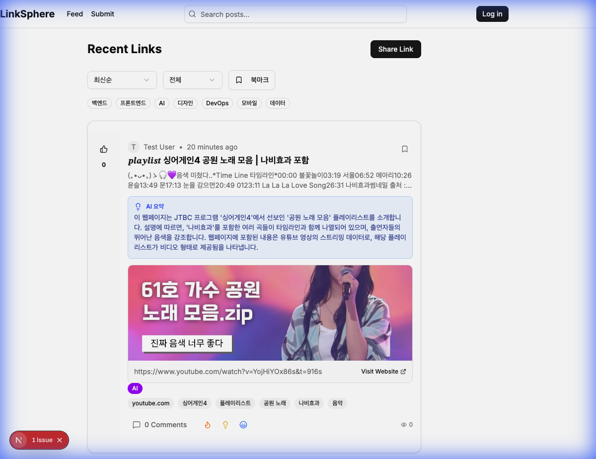

# LinkSphere

**사내 동료들과 유용한 링크를 공유하기 위한 내부 SNS**

> 이 프로젝트는 Google DeepMind의 고급 에이전트 코딩 어시스턴트인 **Anti-gravity**를 사용하여 개발되었습니다.

## 📸 메인 페이지



## ✨ 주요 기능

### 🚀 비동기 AI 요약
- **빠른 게시물 생성**: 링크를 공유하면 즉시 게시물이 생성됩니다
- **백그라운드 AI 분석**: AI가 백그라운드에서 링크 내용을 분석하고 요약합니다
- **실시간 업데이트**: 페이지 새로고침 없이 AI 요약이 자동으로 나타납니다 (3초마다 폴링)

### 📊 핵심 기능
- **자동 메타데이터 추출**: URL의 OG 이미지, 제목, 설명을 자동으로 가져옵니다
- **AI 태그 생성**: Gemini API를 활용하여 관련 태그를 자동으로 생성합니다
- **조회수 추적**: 게시물이 얼마나 많이 조회되었는지 확인할 수 있습니다
- **반응 기능**: 👍 🔥 💡 😂 이모지로 게시물에 반응할 수 있습니다
- **댓글 시스템**: 링크에 대해 동료들과 토론할 수 있습니다
- **북마크**: 나중에 읽을 링크를 저장할 수 있습니다
- **카테고리 필터링**: 백엔드, 프론트엔드, AI, 디자인 등으로 필터링 가능합니다

### 🎨 사용자 경험
- **반응형 디자인**: 모바일과 데스크톱 모두에서 최적화된 레이아웃
- **2단 레이아웃**: 게시물 상세 페이지에서 댓글을 사이드바로 분리
- **강조된 링크 표시**: "Visit Website" 버튼으로 외부 링크를 명확하게 구분

## 🛠 기술 스택

- **프레임워크**: Next.js 15 (App Router, TypeScript)
- **데이터베이스**: Prisma + SQLite (개발) / PostgreSQL (프로덕션)
- **인증**: NextAuth.js (Google OAuth, Email/Password)
- **UI**: shadcn/ui + Tailwind CSS
- **AI**: Google Gemini API
- **기타**: date-fns, cheerio, lucide-react

## 🚀 시작하기

### 1. 저장소 클론
```bash
git clone https://github.com/BAECHAN/link-sns_by_anti-gravity.git
cd link-sns_by_anti-gravity
```

### 2. 의존성 설치
```bash
npm install
```

### 3. 환경 변수 설정
`.env` 파일을 생성하고 다음 내용을 추가하세요:
```env
DATABASE_URL="file:./dev.db"
NEXTAUTH_SECRET="your-secret-key-here"
NEXTAUTH_URL="http://localhost:3000"
GOOGLE_CLIENT_ID="your-google-client-id"
GOOGLE_CLIENT_SECRET="your-google-client-secret"
GEMINI_API_KEY="your-gemini-api-key"
```

### 4. 데이터베이스 마이그레이션
```bash
npx prisma migrate dev
```

### 5. 개발 서버 실행
```bash
npm run dev
```

브라우저에서 [http://localhost:3000](http://localhost:3000)을 열어 확인하세요.

## 📦 배포

Vercel에 배포하기:
1. Vercel에 프로젝트 임포트
2. 환경 변수 설정
3. 배포

## 🏗 프로젝트 구조

```
link-sns/
├── app/                    # Next.js App Router 페이지
│   ├── api/               # API 라우트
│   │   ├── posts/        # 게시물 CRUD
│   │   │   └── [id]/
│   │   │       └── analyze/  # 비동기 AI 분석
│   │   ├── comments/     # 댓글 API
│   │   └── reactions/    # 반응 API
│   ├── post/[id]/        # 게시물 상세 페이지
│   └── submit/           # 링크 제출 페이지
├── components/            # React 컴포넌트
│   ├── ui/               # shadcn/ui 컴포넌트
│   ├── post-card.tsx     # 게시물 카드 (실시간 폴링 포함)
│   └── submit-form.tsx   # 링크 제출 폼
├── lib/                   # 유틸리티 함수
│   ├── auth.ts           # NextAuth 설정
│   └── prisma.ts         # Prisma 클라이언트
└── prisma/               # 데이터베이스 스키마
    └── schema.prisma
```

## 🎯 주요 구현 사항

### 비동기 AI 처리
게시물 생성과 AI 분석을 분리하여 사용자 경험을 개선했습니다:
1. 사용자가 링크 제출 → 즉시 게시물 생성 (OG 메타데이터만 포함)
2. 클라이언트가 `/api/posts/[id]/analyze` 엔드포인트를 백그라운드에서 호출
3. AI가 링크 내용을 분석하고 요약 및 태그 생성
4. `PostCard` 컴포넌트가 3초마다 폴링하여 AI 요약이 준비되면 자동으로 표시

### 실시간 업데이트
`useEffect` 훅을 사용하여 AI 요약이 없는 게시물을 자동으로 폴링합니다:
- 3초마다 서버에 요청
- AI 요약이 준비되면 즉시 UI 업데이트
- 60초 후 자동으로 폴링 중지 (리소스 절약)

---

*Built with ❤️ using Anti-gravity (Google DeepMind's Advanced Agentic AI Coding Assistant)*
